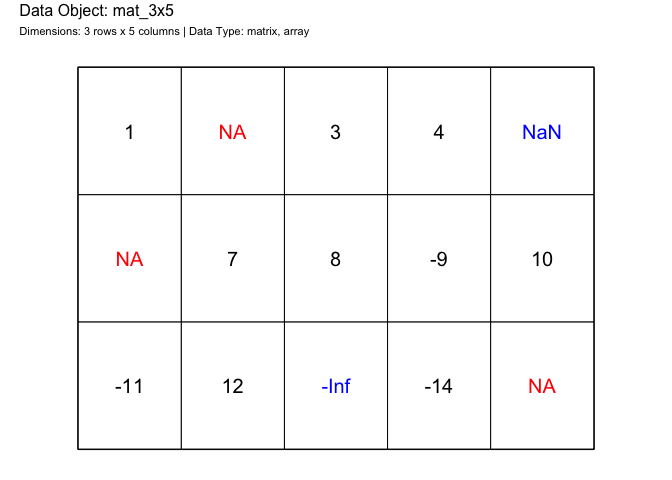
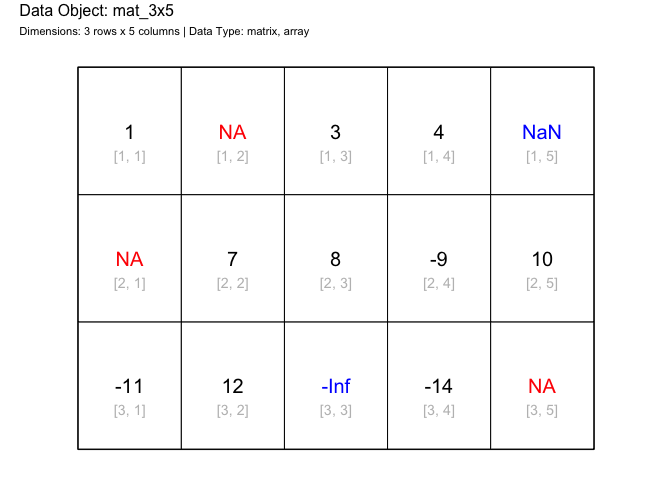
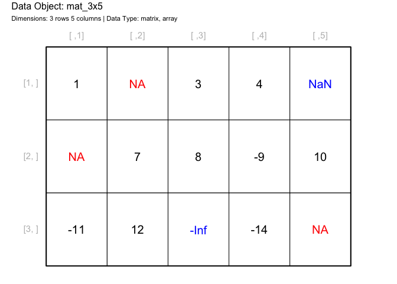
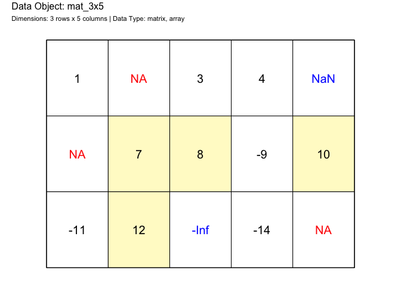
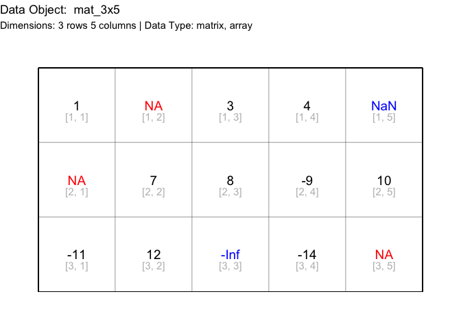
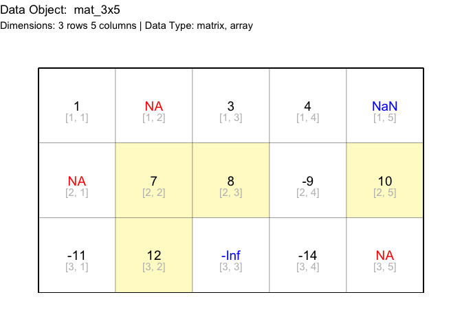

<!-- README.md is generated from README.Rmd. Please edit that file -->

# drawr

<!-- badges: start -->

[](https://github.com/coatless-rpkg/drawr/actions/workflows/R-CMD-check.yaml)
<!-- badges: end -->

The goal of `drawr` is to draw different *R* data structures on graphs.

## Installation

You can install the development version of drawr from
[GitHub](https://github.com/) with:

``` r
# install.packages("devtools")
devtools::install_github("coatless-rpkg/drawr")
```

## Design

The package is designed to take advantage of base R graphics alongside
`ggplot2`. We’re providing two different implementations for each system
under the naming scheme of:

- `draw_*()`: base R graphics
- `gdraw_*()`: `ggplot2`

## Example

Take for instance we have a matrix that looks like so:

``` r
mat_3x5 = matrix(
  c(
   1, NA,    3,   4,  NaN, 
  NA,  7,    8,  -9,  10, 
 -11, 12, -Inf, -14,  NA
 ),
 ncol = 5, byrow = TRUE)

mat_3x5
#>      [,1] [,2] [,3] [,4] [,5]
#> [1,]    1   NA    3    4  NaN
#> [2,]   NA    7    8   -9   10
#> [3,]  -11   12 -Inf  -14   NA
```

What if we wanted to see the contents layed out with their indices?

``` r
# Load the library
library(drawr)

# Graphic of matrix data structure using base R graphics
draw_matrix(mat_3x5)
```



``` r
# Disable showing the cell indices
draw_matrix(mat_3x5, show_cell_indices = FALSE)
```



``` r
# Disable showing any indices
draw_matrix(
  mat_3x5, 
  show_row_indices = TRUE, show_column_indices = TRUE,
  show_cell_indices = FALSE)
```



``` r
# Highlight cells over a specific value
draw_matrix(mat_3x5, highlight_cells = mat_3x5 > 4)
```



We can achieve similar results with the `ggplot2` function.

``` r
# Graphic of matrix data structure using base R graphics
gdraw_matrix(mat_3x5)
```



``` r
# Disable showing the cell indices
gdraw_matrix(mat_3x5, show_cell_indices = FALSE)
```


``` r
# Show row and column indices
gdraw_matrix(
  mat_3x5, 
  show_row_indices = TRUE, show_column_indices = TRUE,
  show_cell_indices = FALSE)
```


``` r
# Highlight cells over a specific value
gdraw_matrix(mat_3x5, highlight_cells = mat_3x5 > 4)
```


