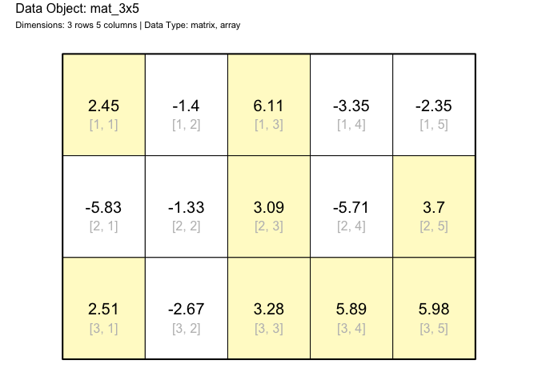
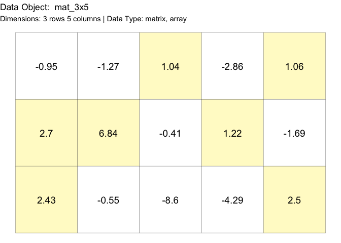

- [drawr](#drawr)
  - [Installation](#installation)
  - [Example](#example)

<!-- README.md is generated from README.Rmd. Please edit that file -->

# drawr

<!-- badges: start -->

[](https://github.com/coatless-rpkg/drawr/actions/workflows/R-CMD-check.yaml)
<!-- badges: end -->

The goal of `drawr` is to draw different *R* data structures on graphs.

## Installation

You can install the development version of drawr from
[GitHub](https://github.com/) with:

``` r
# install.packages("devtools")
devtools::install_github("coatless-rpkg/drawr")
```

## Example

This is a basic example which shows you how to solve a common problem:

``` r
# Load the library
library(drawr)

# Randomly filled matrix
mat_3x5 = matrix(round(rnorm(15, 0, 4), 2), ncol = 5)

# Graphic of matrix data structure using base R graphics
draw_matrix(mat_3x5, highlight_cells = mat_3x5 > 0)

# Graphic of matrix data structure using ggplot2 
gdraw_matrix(mat_3x5, highlight_cells = mat_3x5 > 0)
```


