# paintr [](https://r-pkg.thecoatlessprofessor.com/paintr/)

The goal of `paintr` is to draw different *R* data structures as
pictures. Each value sits in its own cell, and under each cell `paintr`
writes **the expression you would type to reach it** – so the drawing
and the code are the same object. It is built for teaching, where the
hard part is helping someone *see* the shape of the thing they are
working with.

> \[!NOTE\]
>
> A previous version of the package was called `drawr`; however, another
> package with the same name was published on CRAN. As a result, the
> package was renamed to `paintr`.

## Installation

You can install the development version of `paintr` from
[GitHub](https://github.com/) with:

``` r

# install.packages("remotes")
remotes::install_github("coatless-rpkg/paintr")
```

## Design

The package takes advantage of base R graphics alongside `ggplot2`.
Every structure has two painters, under the naming scheme:

- `paint_*()`: base R graphics, drawn straight to the device.
- `gpaint_*()`: `ggplot2`, returning a ggplot object you can print or
  save.

`paintr` draws five structures: **vectors**, **matrices**, **data
frames**, **lists**, and **arrays**.

``` r

library(paintr)
```

## Vectors

A vector is a one-dimensional run of values, and that is how it draws.
Under each cell is the expression you would type to reach it: `[3]` for
the third value. Give the vector names and the label becomes the named
accessor, `["mon"]`, because `x["mon"]` is now how you reach that value.

``` r

paint_vector(c(mon = 12, tue = 19, wed = 3, thu = 8), layout = "horizontal")
```


## Matrices

A matrix is a grid, so it draws as one. Take a matrix with a few awkward
values:

``` r

mat_3x5 = matrix(
  c(
   1, NA,    3,   4,  NaN,
  NA,  7,    8,  -9,  10,
 -11, 12, -Inf, -14,  NA
 ),
 ncol = 5, byrow = TRUE)

mat_3x5
#>      [,1] [,2] [,3] [,4] [,5]
#> [1,]    1   NA    3    4  NaN
#> [2,]   NA    7    8   -9   10
#> [3,]  -11   12 -Inf  -14   NA
```

We can lay out its contents, label the cells with their `[row, column]`
subscript, or highlight the cells that meet a condition – a comparison
*is* a highlight mask.

``` r

# Show the cell indices
paint_matrix(mat_3x5, show_indices = "cell")
```

![A 3 by 5 matrix shown as a grid of cells holding its values, including
NA, NaN, and -Inf, with each cell labeled below by its \[row, column\]
subscript.](reference/figures/README-base-example-1.png)

``` r

# Highlight cells over a specific value
paint_matrix(mat_3x5, highlight_area = mat_3x5 > 4)
```


The same picture is available with `ggplot2`:

``` r

gpaint_matrix(mat_3x5,
             show_indices = c("row", "column"),
             highlight_area = highlight_columns(mat_3x5, columns = 2:4))
```


## Data frames

A data frame gets the richest default picture: a header of column names,
the type of each column beneath it, and a row-name gutter when the row
names are meaningful. Numbers show three significant figures, with
trailing digits in grey.

``` r

paint_data_frame(head(mtcars[, 1:5]))
```


## Lists

A list is the flexible container: its elements can differ in length and
type, so `paintr` draws each element as a column. A data frame is just a
list whose elements share a length – break one length and the rectangle
breaks with it.

``` r

paint_list(list(id = 1:3, tags = c("a", "b"), ok = c(TRUE, FALSE, NA)))
```


## Arrays

An array of three or more dimensions is a stack of matrices, and
[`paint_array()`](https://r-pkg.thecoatlessprofessor.com/paintr/reference/paint-array.md)
lays that stack out as a row of blocks sharing one font size. The label
under a cell is its full subscript, a genuine n-dimensional index.

``` r

paint_array(HairEyeColor)
```


## Learn more

Four vignettes go deeper:

- **Getting started with paintr** – the full tour of all five
  structures.
- **Highlighting cells** – spotlight rows, columns, and individual
  cells.
- **Base graphics and ggplot2** – the `paint_` and `gpaint_` split, and
  when each backend pays off.
- **Teaching with paintr** – putting these pictures to work in lessons.

``` r

browseVignettes("paintr")
```

Full documentation lives at
<https://r-pkg.thecoatlessprofessor.com/paintr/>.
